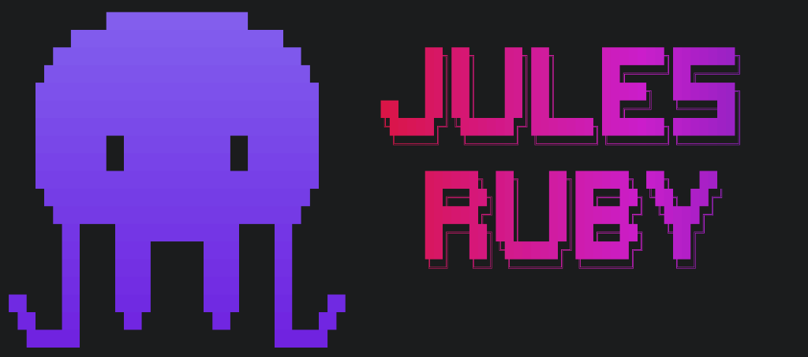

# Jules Ruby

<p align="center">
  
</p>

[](https://badge.fury.io/rb/jules-ruby)
[](https://github.com/tweibley/jules-ruby/actions/workflows/ci.yml)

A Ruby gem for interacting with the [Jules API](https://developers.google.com/jules/api) to programmatically create and manage asynchronous coding tasks.

## Installation

Add this line to your application's Gemfile:

```ruby
gem 'jules-ruby'
```

Then execute:

```bash
bundle install
```

Or install it yourself:

```bash
gem install jules-ruby
```

## Configuration

### Using environment variables (recommended)

Create a `.env` file in your project root:

```
JULES_API_KEY=your_api_key_here
```

The gem automatically loads from `.env` using dotenv.

### Using Ruby configuration

```ruby
require 'jules-ruby'

JulesRuby.configure do |config|
  config.api_key = 'your_api_key_here'
  config.timeout = 60 # optional, default is 30 seconds
end
```

### Per-client configuration

```ruby
client = JulesRuby::Client.new(api_key: 'different_api_key')
```

## Command-Line Interface

The gem includes a CLI for interacting with the Jules API from your terminal.

### Installation

After installing the gem, the `jules-ruby` command becomes available:

```bash
jules-ruby help
```

### Commands

#### Sources

```bash
# List all connected repositories
jules-ruby sources list
jules-ruby sources list --format=json

# Show source details
jules-ruby sources show sources/github/owner/repo
```

#### Sessions

```bash
# List all sessions
jules-ruby sessions list
jules-ruby sessions list --format=json

# Show session details
jules-ruby sessions show <session_id>

# Create a new session
jules-ruby sessions create \
  --source=sources/github/owner/repo \
  --branch=main \
  --prompt="Fix the login bug" \
  --title="Fix Login" \
  --auto-pr

# Approve a plan
jules-ruby sessions approve <session_id>

# Send a message
jules-ruby sessions message <session_id> --prompt="Also add unit tests"

# Delete a session
jules-ruby sessions delete <session_id>
```

#### Activities

```bash
# List activities for a session
jules-ruby activities list <session_id>
jules-ruby activities list <session_id> --format=json

# Show activity details
jules-ruby activities show sessions/<session_id>/activities/<activity_id>
```

### Interactive Mode

Start the interactive TUI for guided workflows:

```bash
jules-ruby interactive
# or
jules-ruby -i
```

Interactive mode provides:
- **Main menu** - Navigate between actions
- **Session wizard** - Step-by-step session creation with source selection
- **Session viewer** - View details, approve plans, send messages, delete
- **Activities viewer** - See session progress and history

### Output Formats

All list commands support `--format=table` (default) or `--format=json`.

### Gemini CLI Extension

Use jules-ruby directly from [Gemini CLI](https://github.com/google-gemini/gemini-cli) with our extension:

👉 [jules-ruby-gemini-cli-extension](https://github.com/tweibley/jules-ruby-gemini-cli-extension)

## Usage

### Initialize the client

```ruby
require 'jules-ruby'

client = JulesRuby::Client.new
```

### Sources

List your connected repositories:

```ruby
# List sources with pagination
result = client.sources.list(page_size: 10)
result[:sources].each do |source|
  puts "#{source.name}: #{source.github_repo.full_name}"
end

# Get all sources
sources = client.sources.all
```

### Sessions

Create and manage coding sessions:

```ruby
# Create a new session
session = client.sessions.create(
  prompt: "Fix the login bug in the authentication module",
  source_context: {
    "source" => "sources/github/myorg/myrepo",
    "githubRepoContext" => { "startingBranch" => "main" }
  },
  title: "Fix Login Bug",
  automation_mode: "AUTO_CREATE_PR"  # optional: auto-create PR when done
)

puts "Session created: #{session.url}"
puts "State: #{session.state}"

# List sessions
result = client.sessions.list(page_size: 10)
result[:sessions].each { |s| puts "#{s.title}: #{s.state}" }

# Get a specific session
session = client.sessions.find("12345678")
# or
session = client.sessions.find("sessions/12345678")

# Check session state
if session.awaiting_plan_approval?
  client.sessions.approve_plan(session.name)
end

# Send a message to the agent
client.sessions.send_message(session.name, prompt: "Can you also add unit tests?")

# Delete a session
client.sessions.destroy(session.name)
```

### Activities

Monitor session progress:

```ruby
# List activities for a session
result = client.activities.list(session.name, page_size: 30)

result[:activities].each do |activity|
  case activity.type
  when :plan_generated
    puts "Plan: #{activity.plan.steps.map(&:title).join(', ')}"
  when :progress_updated
    puts "Progress: #{activity.progress_title}"
  when :session_completed
    puts "Session completed!"
  when :session_failed
    puts "Failed: #{activity.failure_reason}"
  end
end

# Get all activities
activities = client.activities.all(session.name)
```

### Working with models

#### Session states

```ruby
session.queued?                 # Waiting to start
session.planning?               # Creating a plan
session.awaiting_plan_approval? # Needs plan approval
session.awaiting_user_feedback? # Waiting for user input
session.in_progress?            # Working on the task
session.completed?              # Finished successfully
session.failed?                 # Failed
session.active?                 # Any non-terminal state
```

#### Activity types

```ruby
activity.agent_message?    # Agent posted a message
activity.user_message?     # User posted a message
activity.plan_generated?   # A plan was created
activity.plan_approved?    # A plan was approved
activity.progress_update?  # Progress update
activity.session_completed? # Session completed
activity.session_failed?   # Session failed

# Get content based on type
activity.message           # For agent/user messages
activity.plan              # For plan_generated (returns Plan object)
activity.progress_title    # For progress updates
activity.failure_reason    # For session_failed
```

#### Artifacts

```ruby
activity.artifacts.each do |artifact|
  case artifact.type
  when :change_set
    puts "Changes to: #{artifact.source}"
    puts "Commit message: #{artifact.suggested_commit_message}"
  when :bash_output
    puts "Command: #{artifact.bash_command}"
    puts "Output: #{artifact.bash_output_text}"
    puts "Exit code: #{artifact.bash_exit_code}"
  when :media
    puts "Media type: #{artifact.media_mime_type}"
  end
end
```

## Error Handling

```ruby
begin
  client.sessions.find("nonexistent")
rescue JulesRuby::AuthenticationError => e
  puts "Invalid API key"
rescue JulesRuby::NotFoundError => e
  puts "Session not found"
rescue JulesRuby::RateLimitError => e
  puts "Rate limit exceeded, try again later"
rescue JulesRuby::ServerError => e
  puts "Server error: #{e.message}"
rescue JulesRuby::Error => e
  puts "API error: #{e.message} (status: #{e.status_code})"
end
```

## Requirements

- Ruby 3.0+
- async-http gem

## Development

```bash
# Install dependencies
bundle install

# Run tests
bundle exec rspec

# Run linter
bundle exec rubocop
```

## License

The gem is available as open source under the terms of the [MIT License](https://opensource.org/licenses/MIT).
